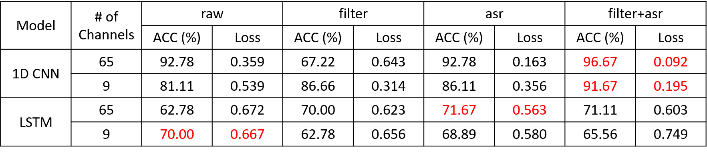

# Deep Learning
### Description
- Load Data
    - load data from npy
    - split train set to train set and validation set by ratio 8:2
    - normalize data by mean and standard
    - the output will be: x_train, x_val, x_test, y_train, y_val, y_test 
- Model: use normal model structure for processing time series dataset
    - Since the size of dataset is too large, we use maxpooling to reduce computation and over-fitting. Additionally, we double the feature channels and after maxpooling to extract more fine-grained features
    - Model Structure
    
        - 1D CNN
        
        - LSTM
        
- Training & Testing
    - load data
    - compile model
        - optimizer: Adam
            - The advantage of adam algorithm is that it is "computationally efficient, has little memory requirement, invariant to diagonal rescaling of gradients, and is well suited for problems that are large in terms of data/parameters"
        - loss: BinaryCrossentropy
            - Generally, it will use cross-entropy loss when computing loss between true labels and predicted labels
            - Binary cross-entropy loss will be used when the label is binary(0 or 1)
    - training
    - testing
### Project Setup
- Environment
    - reference: [install tensorflow](https://www.tensorflow.org/install/pip#software_requirements)
        ``` bash
        $ conda create --name bci_tf python=3.8
        $ conda activate bci_tf
        $ conda install -c anaconda tensorflow-gpu
        $ conda install -c anaconda pip
        $ conda install -c anaconda numpy==1.18.5
        $ conda install -c conda-forge matplotlib
        $ conda install -c conda-forge scikit-learn
        ```
- train.py
    - Self-defined variable
        ```python
        # in train.py
        ## dataset variable ##
        dataset_root = fr"/local/SSD/bci_dataset_npy/" # your dataset directory path after preprocessing and split
        npy_types = ["raw", "asr", "filter", "filter_asr"]
        npy_type = npy_types[3] # your dataset type version
        ## ##

        ## model variable ##
        BATCH_SIZE = 256
        EPOCHS = 100
        LEARNING_RATE = 0.001
        TRAIN = True # whether to train or not
        TEST = True # whether to test or not
        load_weights = '' # model pretrain weight 
        model_types = ["oneD_CNN", "LSTM"]
        model_type = model_types[0] # model version
        ## ##

        ## result path ##
        model_name = "oneD_CNN_v2" # model name / result directory name
        result_root = "./result"
        ## ##
        ```
    - How to use
        ```bash
        $ CUDA_VISIBLE_DEVICES=0 python train.py
        ```
### Methods for Load Data
- split data
    ```python
    # in loaddata.py
    def train_val_split(dataset, split_ratio=0.8):
        num = len(dataset)
        split_arr = np.split(dataset, [int(num*split_ratio)], axis=0)

        # for i in split_arr:
        #     print(i.shape)

        return split_arr[0], split_arr[1]
    ```
- normalize
    ```python
    # in loaddata.py
    def normalize(x_train, x_val, x_test):
        train_mean = x_train.mean()
        train_std = x_train.std()

        train_normalize = (x_train - train_mean) / train_std
        val_normalize = (x_val - train_mean) / train_std
        test_normalize = (x_test - train_mean) / train_std
        return train_normalize, val_normalize, test_normalize
    ```
### Methods for Build Model
- Model Structure
    - 1D CNN
        ```python
        # in model.py
        def oneD_CNN(input_shape):
            conv_model = tf.keras.Sequential(layers=[
                tf.keras.layers.Conv1D(filters=32, kernel_size=(7,), activation='relu', input_shape=input_shape[1:]),
                tf.keras.layers.Conv1D(filters=32, kernel_size=(7,), activation='relu', input_shape=input_shape[1:]),
                tf.keras.layers.MaxPool1D(pool_size=2),

                tf.keras.layers.Conv1D(filters=64, kernel_size=(5,), strides=2, activation='relu', input_shape=input_shape[1:]),
                tf.keras.layers.Conv1D(filters=64, kernel_size=(5,), activation='relu', input_shape=input_shape[1:]),
                tf.keras.layers.MaxPool1D(pool_size=2),

                tf.keras.layers.Conv1D(filters=128, kernel_size=(5,), strides=2, activation='relu', input_shape=input_shape[1:]),
                tf.keras.layers.Conv1D(filters=128, kernel_size=(5,), activation='relu', input_shape=input_shape[1:]),
                tf.keras.layers.MaxPool1D(pool_size=2),
                tf.keras.layers.GlobalAveragePooling1D(),

                tf.keras.layers.Dropout(rate=0.2),
                tf.keras.layers.Dense(units=32, activation='relu'),
                tf.keras.layers.Dense(units=1, activation='sigmoid'),
            ], name="1DCNN_v2")
            return conv_model
        ```
    - LSTM
        ```python
        # in model.py
        def LSTM(input_shape):
            multi_lstm_model = tf.keras.Sequential([
                tf.keras.layers.MaxPool1D(pool_size=4, input_shape=input_shape[1:]),
                tf.keras.layers.LSTM(units=32, return_sequences=True),
                tf.keras.layers.MaxPool1D(pool_size=4),
                tf.keras.layers.LSTM(units=64, return_sequences=True),
                tf.keras.layers.MaxPool1D(pool_size=4),
                tf.keras.layers.LSTM(units=128, return_sequences=True),
                tf.keras.layers.MaxPool1D(pool_size=4),
                tf.keras.layers.LSTM(units=256, return_sequences=False),
                tf.keras.layers.Dropout(rate=0.2),
                tf.keras.layers.Dense(units=32, activation='relu'),
                tf.keras.layers.Dense(units=1, activation='sigmoid'),
            ], name="LSTM_v2")
            return multi_lstm_model
        ```
- Compile Model
    ```python
    # in train.py
    model = oneD_CNN(input_shape=x_train.shape)
    # model = LSTM(input_shape=x_train.shape)

    # load model weight
    model.load_weights(filepath=load_weights,by_name=True, skip_mismatch=True)

    # opimizer and loss
    optimizer = keras.optimizers.Adam( learning_rate=LEARNING_RATE, beta_1=0.9, beta_2=0.999, epsilon=None, decay=1e-7, amsgrad=False)
    loss = keras.losses.BinaryCrossentropy(from_logits=True)

    # compile model
    model.compile(loss=loss, optimizer=optimizer, metrics=['acc'])
    ```
### Methods for Training and Testing
- Training
    ```python
    # in train.py
    def train(model, result_record_path, x_train, x_val, y_train, y_val):
        print("="*80)
        print("Model Training")
        optimizer = keras.optimizers.Adam( learning_rate=LEARNING_RATE, beta_1=0.9, beta_2=0.999, epsilon=None, decay=1e-7, amsgrad=False)
        loss = keras.losses.BinaryCrossentropy(from_logits=True)

        callbacks = [
            ModelCheckpoint(filepath=result_record_path+'.h5', save_weights_only=True, verbose=1, save_best_only=True), # for save model checkpoint
            History(), #record loss and acc
            CSVLogger(result_record_path+"_acc.csv", append=load_weights != '') # save loss and acc in csv file
        ]

        model.compile(loss=loss, optimizer=optimizer, metrics=['acc'])

        # train model
        history = model.fit(x_train, y_train,
            batch_size=BATCH_SIZE,
            epochs=EPOCHS,
            verbose=1,
            shuffle=True,
            validation_data=(x_val, y_val), callbacks=callbacks)

        print("Model Training Finish")
        print("="*80)
        return history
    ```
- Testing
    ```python
    def test(model, model_name, date, result_record_path, x_test, y_test):
        print("="*80)
        print("Model Testing")

        optimizer = keras.optimizers.Adam( learning_rate=LEARNING_RATE, beta_1=0.9, beta_2=0.999, epsilon=None, decay=1e-7, amsgrad=False)
        loss = keras.losses.BinaryCrossentropy(from_logits=True)
        model.compile(loss=loss, optimizer=optimizer, metrics=['acc'])

        # testing loss and accuracy
        loss, accuracy = model.evaluate(x_test, y_test)
        print("acc: {acc}, loss: {loss}".format(acc=accuracy, loss=loss))

        # predict test set labels
        y_pred = model.predict(x_test)

        # compute True Positive, False Positive, False Negative, True Negative
        confusion_mat = sklearn.metrics.confusion_matrix(y_test, np.round(y_pred))

        print("True Positive for SZ: {TP}".format(TP=confusion_mat[0, 0]))
        print("False Positive for SZ: {FP}".format(FP=confusion_mat[0, 1]))
        print("False Negative for HC: {FN}".format(FN=confusion_mat[1, 0]))
        print("True Negative for HC: {TN}".format(TN=confusion_mat[1, 1]))

        # save results in txt file
        with open(result_record_path+"_test_result.txt", 'w') as f:
            f.write("model_name: {model_name}, training_date={training_date}\n".format(model_name=model_name, training_date=date))
            f.write("acc: {acc}, loss: {loss}\n".format(acc=accuracy, loss=loss))
            f.write("True Positive for SZ: {TP}\n".format(TP=confusion_mat[0, 0]))
            f.write("False Positive for SZ: {FP}\n".format(FP=confusion_mat[0, 1]))
            f.write("False Negative for HC: {FN}\n".format(FN=confusion_mat[1, 0]))
            f.write("True Negative for HC: {TN}".format(TN=confusion_mat[1, 1]))
        
        print("Model Testing Finish")
        print("="*80)
    ```
### Results
- Accuracy and Loss


- Results


